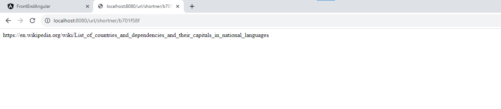

# URL Shortener App - Spring Boot & Angular

## Overview

This URL Shortener App is a powerful tool for converting long URLs into short, easily shareable links. It leverages the Spring Boot framework on the backend and Angular on the frontend to provide a seamless user experience. Below are some of the key features of this application:

### Features

1. **Shorten Long URLs**: Convert user-provided long URLs into concise short links. Clicking on these short links will seamlessly redirect users to the original long URL.

2. **Robust Hashing Algorithm**: Utilizes the Murmur3_32_fixed() algorithm from `com.google.common.hash.Hashing` for reliable and efficient URL conversion.

3. **URL Validation**: Ensures the validity of user-provided URLs using the `org.apache.commons.validator.routines.UrlValidator` library, guaranteeing that only valid URLs are processed.

4. **Efficient Caching**: Employ Spring Redis Data for efficient caching of URL results. This cache reduces the load on the MS SQL server, where the short URL mappings are stored, resulting in improved performance and responsiveness.


## Project Overview

### Back end API responses

1. Wikipedia Long URL


2. Short URL generation


3. Retrieve Long URL


4. Fake URL Validation


### Front end API responses

1. Wikipedia Long URL to Short URL Generation


2. Short URL generation


3. URL Redirection



4. URL Redirection


5. Fake URL Validation


6. Server Down Validation


## Running the Application

### Spring Boot Backend

1. Clone this repository.
2. Navigate to the Spring Boot project directory.
3. Run the Maven project on port 8080:

   ```shell
   mvn spring-boot:run

The Spring Boot application will start on port 8080.

### Angular Frontend
1. Navigate to the Angular app directory.

2. Install dependencies using npm :

    ```shell
    npm install

3. Start the Angular app on port 4200:

    ```shell
    ng serve --port 4200
The Angular application will be accessible at http://localhost:4200